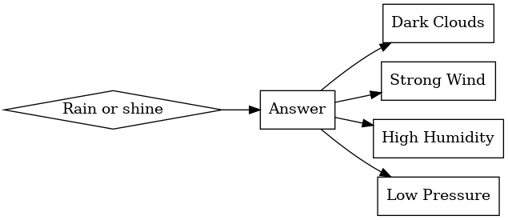

# User Guide for PersonAI

## Introduction

Welcome to PersonAI, your friendly companion for brainstorming and exploring new ideas and questions! Imagine having a chat with a highly knowledgeable friend. You explain what you're curious about, and they help you explore it. Or think of it as a MindMap that helps you divide and conquer the information you seek. This guide will help you get started. No technical expertise required!

## Table of Contents

1. [Introduction](#introduction)
2. [Getting Started](#getting-started)
3. [The Brainstorming Graph](#the-brainstorming-graph)
4. [Asking Questions](#asking-questions)
5. [Using Pre-cooked Questions](#using-pre-cooked-questions)
6. [Tabs for Your Thoughts](#tabs-for-your-thoughts)
7. [Additional Features](#additional-features)

## Getting Started

1. **Opening the Tool**: Double-click the PersonAI icon to open the tool.
2. **Main Screen**: You'll see a graph-like area, a text box, and some buttons. Don't worry, we'll go through each.

## The Brainstorming Graph

This is your visual board where ideas take shape. Each 'node' or bubble represents an idea or piece of information. 

- **Selecting Nodes**: Just click on a node to select it. Right-click to deselect.
- **What Happens Next**: The selected nodes are used to guide the tool in generating more specific information for you.

## Asking Questions

1. **Type Your Question**: In the text box, type a question you have.
2. **Get an Answer**: Press Enter. You'll see a new node appear in the brainstorming graph. This node contains a summarized answer to your question.

<!-- Insert visual here -->

## Using Pre-cooked Questions

If you're not sure what to ask, we've got you covered. Below the text box, there are buttons with pre-cooked questions.

- **How to Use**: Simply click on one of these buttons, and a question will be automatically fed into the text box. Press Enter to get your answer.
- **Tooltip Guidance**: Hover over a button to see a prompt about what the question will ask.

<!-- Insert visual here -->

## Tabs for Your Thoughts

The tool organizes your interactions in different tabs. 

1. **Main Tab**: Displays a preview of the latest answer.
2. **Last Interaction**: Shows the last full dialogue you had.
3. **Custom Tabs**: Clicking an existing, selected node will open it in a new tab, in an easy-to-read HTML format.

<!-- Insert visual here -->

## Additional Features

At the top of the screen, you'll find some buttons for other operations:

- **Exit**: Closes the application.
- **Text Size**: Increase or decrease the text size with the 'bigger text' and 'smaller text' buttons.
- **Save & Load**: Save your current session or load a previous one.
- **Vagrant Operations**: Start, check logs, and stop Vagrant if you're using it. (Don't worry if you're not sure what this is, you might not need it!)

<!-- Insert visual here -->

---

Thank you for using PersonAI! Dive in, ask away, and explore to your heart's content.

